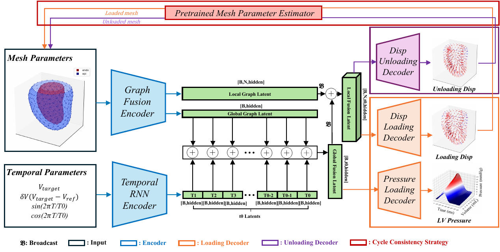

# CardioGraphFENet

Graph neural network for cardiac pressure-volume relationship prediction from ventricular mesh geometry.



## Overview

CardioGraphFENet (CGFENet) predicts full-cycle left ventricular pressure and displacement from mesh geometry using a graph-GRU based encoder with dual decoders 
(DATA and output folders: https://drive.google.com/drive/folders/12dGoPfkK8rVjC4E-C8eBKm8VrAoQwhQU)

**Key Features:**
- Volume-constrained pressure prediction
- Forward cycle: Unloaded mesh geometry → pressure, displacement
- Inverse cycle: Loaded mesh geometry → unloaded mesh geometry

## Output Structure

```
output/
├── dataset_cache.pt                # Cached dataset for fast loading
├── static_encoder/
│   ├── static_encoder.pt           # Pre-trained static encoder weights
│   └── static_pretrain.log         # Static encoder training log
├── train/
│   ├── checkpoint.pt               # Latest checkpoint
│   ├── best_model.pt               # Best validation model
│   ├── train.log                   # Training log
│   ├── loss_history.png            # Loss curves
│   ├── epi_endo_overview.png       # Epi/endo visualization (raw data)
│   ├── pressure_snapshot_*.png     # Pressure prediction snapshots (self-checking during training)
│   ├── mesh_overlays/              # Predicted vs ground truth mesh overlays
│   │   └── validation/mesh*/overlay.png
│   └── val_summary_cases/          # Validation summary plots per mesh
│       └── validation_test_summary_mesh*.png
├── test/
│   ├── test.log                    # Test evaluation log
│   ├── mesh_overlays/              # Test mesh overlay visualizations
│   │   └── mesh*/overlay.png
│   └── summary_cases/              # Test summary plots
│       └── test_summary_mesh*.png
└── pv_inference/
    ├── predicted_pv_loop.txt       # Time, volume, pressure data
    ├── predicted_pv_loop.png       # 2D PV loop visualization
    └── predicted_pv_loop_3d.png    # 3D P-V-T visualization
```

## PV Loop Inference

The `pv_loop_inference.py` script generates pressure predictions along a custom volume trajectory.

**Note:** The predicted PV loop is **volume-constrained** — pressure is predicted given arbitrary volume inputs. Since volumes are sampled from the validation grid, deviations from physiological PV loops may occur.

For closed-loop cardiovascular simulation with realistic boundary conditions, couple with a **lumped parameter circuit model** via [heartFEM](https://github.com/WeiXuanChan/heartFEM) + ngspice. (This is the paper use)

## Usage

```bash
# Pretrain static encoder
python model_train.py --pretrain-static

# Training
python model_train.py

# Testing
python model_train.py --test

# PV loop inference
python pv_loop_inference.py
```

## Requirements

- PyTorch
- PyTorch Geometric
- NumPy, Matplotlib, h5py

## Citation

Paper will be submitted to journal soon
